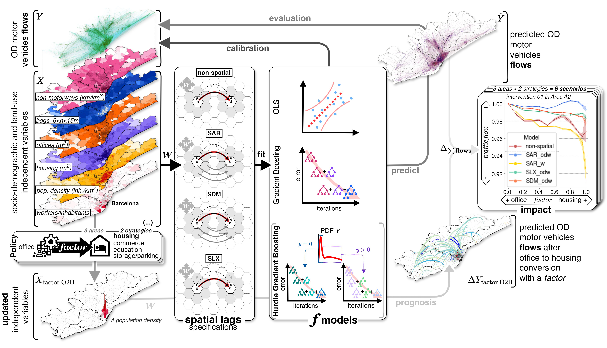

# **Spatial econometrics to estimate traffic reduction by transforming office space into housing and other land uses: The case for Barcelona**
Data and code repository for the article *Spatial econometrics to estimate traffic reduction by transforming office space into housing and other land uses: The case for Barcelona*

# Highlights
- Developed a spatial econometric model to estimate OD traffic matrices in Barcelona.
- Built a non-parametric SLX model with spatial lagged effects using gradient boosting.
- Matched the accuracy of common spatial autoregression models with more flexibility.
- Estimated traffic after converting offices into housing and other uses in Barcelona.
- Discovered that densification may reduce vehicle flows despite increased population.

*Abstract:* Origin-destination (OD) matrices are essential for the analysis, planning, and simulation of urban areas, infrastructure, and transportation systems. However, they are often costly and time-consuming to determine, which reduces their potential use for informed decision-making and planning in cities. This research introduces a novel spatial econometric method that considers spatial spillover effects of socio-demographic, land use, and topological variables to directly estimate traffic OD flows between zones of the Metropolitan Area of Barcelona. Employing a two-part Hurdle model with gradient boosting (XGBoost), our approach achieves low error rates (MAE = 6.109, RMSE = 98.774), comparable to other established models also analyzed, but the proposed method’'s simplicity facilitates its practical application in urban planning and policy-making. This is illustrated by applying the proposed model to predict changes in vehicle flows resulting from the conversion of offices into other urban uses such as housing, commerce, education, or storage. Despite the related population increase, we expect a reduction in vehicle trips by up to 10 % even with limited spatial interventions. Our findings suggest the model’'s power to assess urban trends and policies, particularly in considering teleworking expansion, housing shortages, and contemporary planning practices promoting alternative mobility modes and densification. This research underscores the dual benefits of methodological innovation and practical policy application, marking a significant advancement in urban planning

https://github.com/user-attachments/assets/5494e9cb-c029-41a1-9d31-ee5dc57d9990

  

    This work has been performed with financial support from the European Research Council (ERC) under the European Union’s Horizon 2020 research and innovation program for the project Co-Evolving City Life (CoCi), grant number 833168.
  

  

    
  

