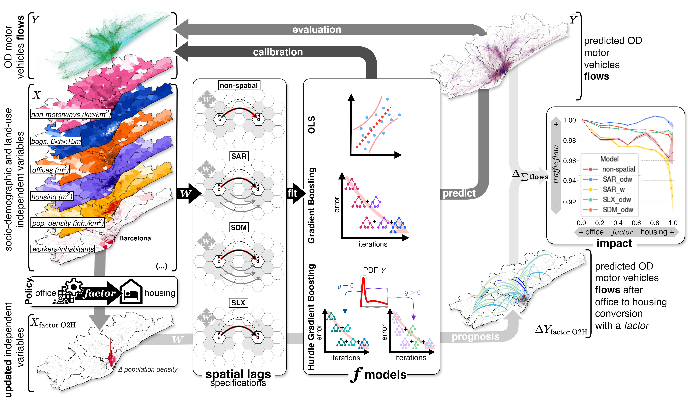

# O2H_BCN

Spatial econometric models for traffic forecasting after office to housing conversion in the Metropolitan Area of Barcelona.
Data and code repository for paper **Estimating traffic reduction by converting offices into housing**.

